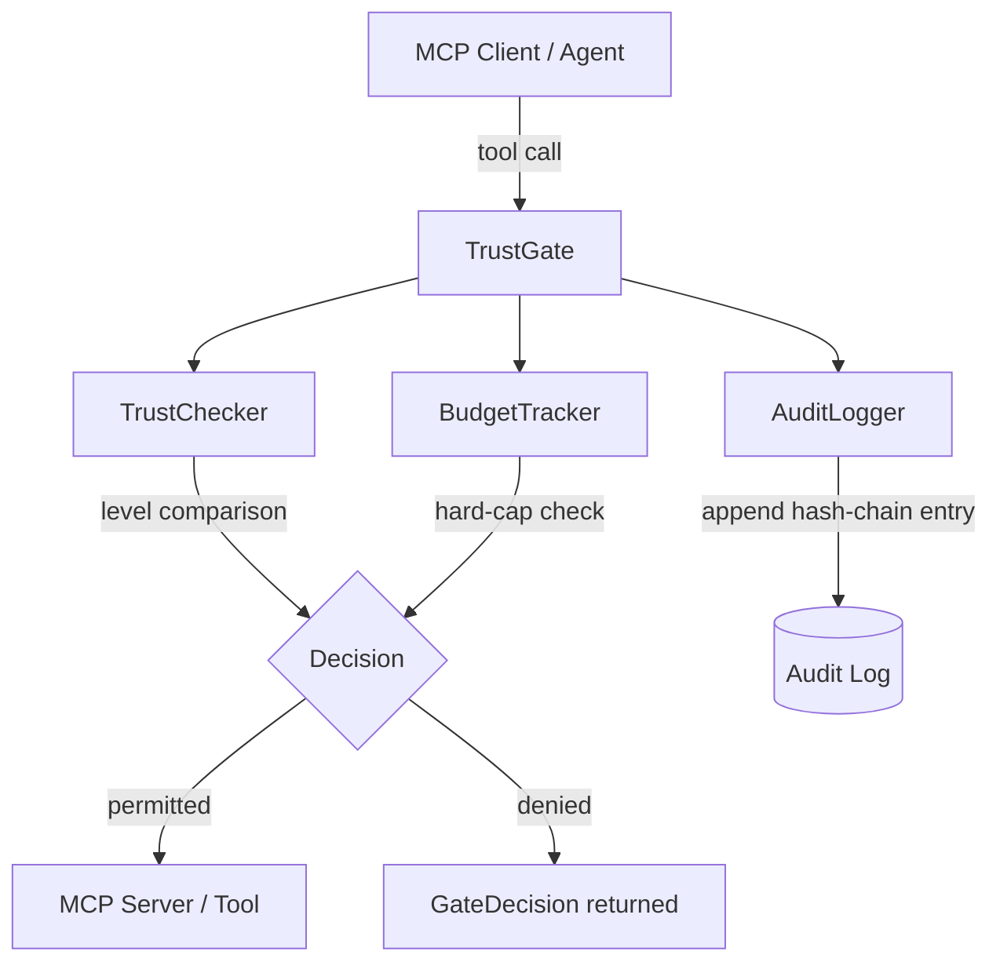

<!-- SPDX-License-Identifier: Apache-2.0 -->
# MCP Trust Gate

[](https://opensource.org/licenses/Apache-2.0)
[](https://www.npmjs.com/package/@aumos/mcp-trust-gate)
[](./FIRE_LINE.md)
[](https://github.com/aumos-ai/mcp-server-trust-gate)

> **The missing security layer for MCP** — drop-in trust enforcement, spending
> budgets, and tamper-evident audit logging for any Model Context Protocol server.

---

## Why Does This Exist?

### The Problem — From First Principles

The Model Context Protocol (MCP) gives AI agents access to tools: file systems,
databases, APIs, email, code execution. By design, MCP focuses on *connectivity*
— it defines how an agent calls a tool, not *whether it should*.

This creates a silent gap. An agent with access to `read-file` also has access
to `delete-file` unless something actively prevents it. Most MCP deployments
bridge that gap with application-level `if` statements scattered across
tool handlers — fragile, untested, and invisible to operators who need audit trails.

### The Analogy — Security Guards, Not Locked Doors

Think of a corporate building. You could lock every individual office door with a
different key, forcing employees to carry a keyring and developers to manage
per-door logic. Or you could place a security guard at the building entrance who
checks credentials once, applies a consistent policy, and logs every entry.

MCP Trust Gate is that security guard. Your MCP server (the building) doesn't
change. Your tools (the offices) don't change. You add the gate in front, configure
which trust level each tool requires, and the gate handles the rest — for every
tool, consistently, with a full audit trail.

### What Happens Without This

Without a dedicated governance layer, MCP deployments typically:

- Grant all agents the same access level, making least-privilege impossible
- Scatter authorization logic across individual tool handlers (impossible to audit)
- Have no spending controls — a single runaway agent can exhaust API budgets
- Produce no tamper-evident record of what was allowed, denied, or why

`@aumos/mcp-trust-gate` solves all four problems with a single, composable package.

---

## Quick Start

### Prerequisites

- Node.js >= 20.0.0
- An existing MCP server (or any tool-calling loop)

### Install

```bash
npm install @aumos/mcp-trust-gate @aumos/types
```

### Minimal Working Example

```typescript
import { TrustGate } from '@aumos/mcp-trust-gate';
import { TrustLevel } from '@aumos/types';

const gate = new TrustGate({
  defaultTrustLevel: TrustLevel.L2_SUGGEST,
  toolTrustRequirements: {
    'read-file':      TrustLevel.L1_MONITOR,
    'send-email':     TrustLevel.L3_ACT_APPROVE,
    'delete-account': TrustLevel.L5_AUTONOMOUS,
  },
});

const decision = gate.evaluate('send-email');

if (!decision.permitted) {
  console.log(decision.reason);
  // "Trust level L2_SUGGEST below required L3_ACT_APPROVE"
} else {
  // safe to execute the tool
}
```

**Expected output:**
```
Trust level L2_SUGGEST below required L3_ACT_APPROVE
```

### What Just Happened?

The gate compared the agent's current trust level (`L2_SUGGEST`) against the
minimum level required for `send-email` (`L3_ACT_APPROVE`). Because the agent
does not yet hold sufficient trust, the call is denied and a reason is returned.
No code inside your MCP server ran. No email was sent.

When you promote the agent — by calling `gate.setTrustLevel(TrustLevel.L4_ACT_REPORT)`
— the same evaluation will now return `permitted: true`, because `L4 >= L3`.

---

## Architecture Overview



**Key internal modules:**

| Module | Responsibility |
|---|---|
| `TrustChecker` | Static `>=` comparison of agent trust vs tool requirement |
| `BudgetTracker` | Hard-cap spending enforcement with period resets |
| `AuditLogger` | Append-only hash-chain audit recording |
| `TrustGate` | Public API — composes the three above |

The dependency direction is strictly one-way: `TrustGate` → `TrustChecker /
BudgetTracker / AuditLogger` → `types / config`. No circular dependencies.

---

## With Budget Enforcement

```typescript
import { TrustGate } from '@aumos/mcp-trust-gate';
import { TrustLevel } from '@aumos/types';

const gate = new TrustGate({
  defaultTrustLevel: TrustLevel.L4_ACT_REPORT,
  toolTrustRequirements: {
    'api-call': TrustLevel.L2_SUGGEST,
  },
  budgetConfig: {
    limitAmount: 10.00,
    currency: 'USD',
    period: 'daily',
  },
});

gate.evaluate('api-call', 2.50);  // permitted — $7.50 remaining
gate.evaluate('api-call', 5.00);  // permitted — $2.50 remaining
gate.evaluate('api-call', 3.00);  // denied    — would exceed $10.00

console.log(gate.getBudgetSummary());
// { spent: 7.5, remaining: 2.5, limit: 10, period: 'daily' }
```

---

## Who Is This For?

**Developers** building MCP-connected agents who need authorization and audit
without reimplementing governance logic in every tool handler.

**Enterprise teams** running multi-agent workflows that need spend controls,
explainable decisions, and a tamper-evident audit trail for compliance.

If you are deploying any MCP server into production, this package belongs in your
middleware stack.

---

## API Reference

### `TrustGate`

The main entry point. Composes `TrustChecker`, `BudgetTracker`, and
`AuditLogger`.

#### Constructor

```typescript
new TrustGate(
  config: Partial<Omit<TrustGateConfig, 'onDeny'>>,
  onDeny?: (decision: GateDecision) => void,
)
```

#### Methods

| Method | Description |
|---|---|
| `evaluate(toolName, estimatedCost?)` | Evaluate a tool call. Returns a `GateDecision`. |
| `setTrustLevel(level)` | Manually assign the agent's trust level. |
| `getTrustLevel()` | Return the current trust level. |
| `setToolRequirement(toolName, level)` | Set the minimum level for a specific tool. |
| `getAuditLog()` | Return all recorded audit entries. |
| `verifyAuditChain()` | Verify hash chain integrity. Returns `boolean`. |
| `getBudgetSummary()` | Return budget utilization snapshot, or `null`. |

### `TrustGateConfig`

| Field | Type | Default | Description |
|---|---|---|---|
| `defaultTrustLevel` | `TrustLevel` | `L0_OBSERVER` | Starting level for new agents. |
| `toolTrustRequirements` | `Record<string, TrustLevel>` | `{}` | Per-tool minimum levels. |
| `budgetConfig` | `BudgetConfig` | — | Optional hard-cap budget. |
| `auditEnabled` | `boolean` | `true` | Enable audit logging. |
| `onDeny` | `(d: GateDecision) => void` | — | Callback on every denial. |

### `BudgetConfig`

| Field | Type | Default | Description |
|---|---|---|---|
| `limitAmount` | `number` | — | Maximum spend per period. |
| `currency` | `string` | `'USD'` | ISO 4217 currency code. |
| `period` | `'hourly' \| 'daily' \| 'weekly' \| 'monthly'` | `'daily'` | Reset window. |

### `GateDecision`

| Field | Type | Description |
|---|---|---|
| `toolName` | `string` | Tool being evaluated. |
| `permitted` | `boolean` | Whether the call is allowed. |
| `reason` | `string` | Human-readable explanation. |
| `trustLevel` | `TrustLevel` | Agent's level at decision time. |
| `requiredLevel` | `TrustLevel` | Tool's minimum required level. |
| `timestamp` | `string` | ISO 8601 UTC timestamp. |
| `budgetRemaining` | `number \| undefined` | Remaining budget (if configured). |

### `TrustChecker`

Lower-level class for direct trust comparison without the full gate wrapper.
Useful when you need to integrate into an existing MCP handler loop.

### `BudgetTracker`

Lower-level class for direct hard-cap budget enforcement.

### `AuditLogger`

Lower-level class for direct hash-chain audit recording.

---

## Exports

```typescript
// Classes
export { TrustGate, TrustChecker, BudgetTracker, AuditLogger };

// Config
export { createConfig, TrustGateConfigSchema };

// Types
export type {
  TrustGateConfig, BudgetConfig, GateDecision, AuditEntry,
  SpendingResult, BudgetSummary, ParsedTrustGateConfig,
};
```

---

## Related Projects

| Project | Description |
|---|---|
| [`a2a-trust-gate`](https://github.com/aumos-ai/a2a-trust-gate) | Same governance model for Google A2A agent-to-agent traffic |
| [`mcp-server-pii-guardian`](https://github.com/aumos-ai/mcp-server-pii-guardian) | PII detection and redaction middleware for MCP |
| [`aumos-core`](https://github.com/aumos-ai/aumos-core) | Core AumOS governance engine and AMGP protocol |
| [`agent-benchmark-governance`](https://github.com/aumos-ai/agent-benchmark-governance) | Test-Driven Governance benchmarks |
| [AumOS Docs](https://github.com/aumos-ai/.github) | Centralized documentation and governance standards |

---

## Patent Gate

This package is subject to a patent gate (P0-01 ATP — Awaiting Patent Filing).

The open-source boundary is documented in [FIRE_LINE.md](./FIRE_LINE.md).
The short version: static trust comparison, static hard caps, and structured
logging are permitted. Adaptive trust progression, behavioral scoring, ML-based
budgets, anomaly detection, and integration with the adaptive governance layer
are reserved.

---

## License

Apache 2.0 — see [LICENSE](./LICENSE).

Copyright (c) 2026 MuVeraAI Corporation.
